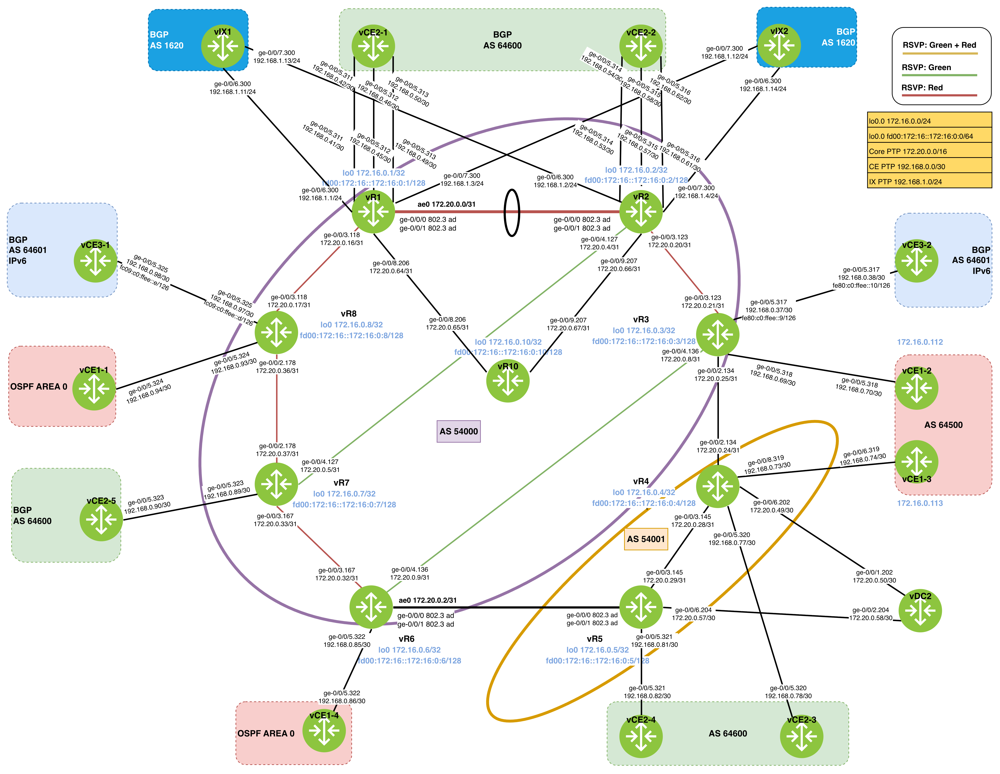

# Tasks

1. Configure route reflector to participate in  exchange of Layer 3 VPN routing information. Do not enable MPLS.
2. Implement TCP Authentication Option to secure the active BGP peering session established between vrr1 and vr3 with algorithm aes-sha-1-96.
3. Configure kompella L2VPN in vr1,vr2 and vr7. 

<details> <summary>Solutions</summary>

```
set interfaces ge-0/0/5 vlan-tagging
set interfaces ge-0/0/5 encapsulation flexible-ethernet-services
set interfaces ge-0/0/5 unit 0 description vr7->vce2-5
set interfaces ge-0/0/5 unit 0 vlan-id 4093
set interfaces ge-0/0/5 unit 323 description "vr7 -> vce2-5"
set interfaces ge-0/0/5 unit 323 encapsulation vlan-vpls
set interfaces ge-0/0/5 unit 323 vlan-id 323
set routing-instances yellow instance-type vpls
set routing-instances yellow protocols vpls interface ge-0/0/5.323
set routing-instances yellow protocols vpls site vr7 site-identifier 7
set routing-instances yellow protocols vpls site-range 10
set routing-instances yellow interface ge-0/0/5.323
set routing-instances yellow route-distinguisher 54001:2
set routing-instances yellow vrf-target target:54001:2
```

</details>