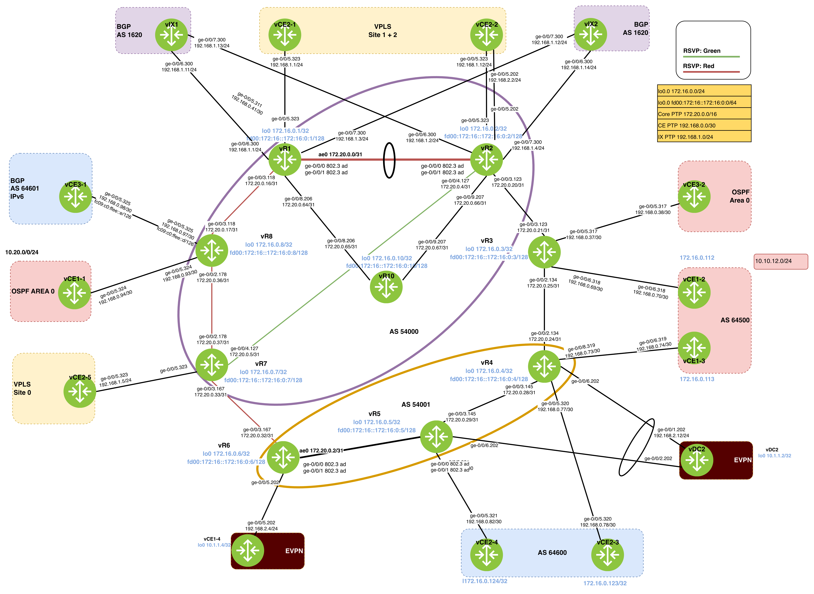

# Tasks

1. Configure route reflector to participate in exchange of L2VPN and L3VPN NLRI. Do not enable MPLS.

2. Implement TCP Authentication Option to secure the active BGP peering session established between route reflector and vr2, vr3 with algorithm aes-sha-1-96.

3. Configure a BGP signaled L2VPN (Kompella) L2VPN to to interconnect vCE2-5 with multi-homed site vCE2-1 and vCE2-2. Multi-homing switchover must take effect if primary attachment circuit fails.

> [!IMPORTANT]
> The no-tunnel-services option enables a virtual labeled switched interface (LSI) for additional lookup. In the case with VPLS, this lookup is in the MAC table. A unique LSI interface is created for each remote site. On MX devices, this command must be configured for VPLS!

> [!Verification]
> 
```
show route table bgp.l2vpn.0
show vpls connection instance xyz
show route forwarding-table family vpls
show vpls mac-table instance xyz
```

4. Configure vlan-based (1 to 1 mapping) evpn instance to connect vCE1-4 and vDC2 using interface vlan-id 202. Load the following config for the CE devices:

```
bash load_junos_config X start vdc2
bash load_junos_config X start vce1-4
```

5. Configure vlan-aware (multiple bridge domains) evpn instance to connect vCE1-4 and vDC2 using interface vlan-id 202. Load the following config for the CE devices:
```
bash load_junos_config X end vdc2
bash load_junos_config X end vce1-4
```