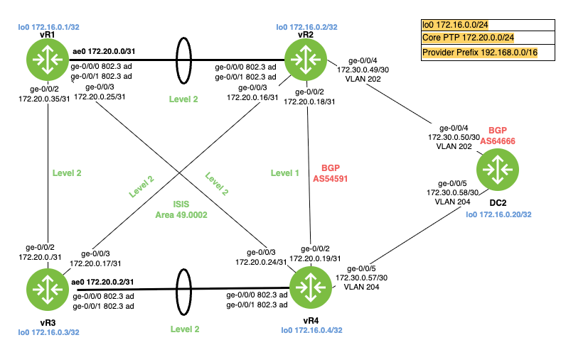

## Objectives
Configure IS-IS domain splitting the network into a Level 1 (Edge) and Level 2 (Backbone) hierarchy, ensuring specific traffic patterns and fast convergence.

## Task 1.1: Interface Setup

* Configure ISO NET addresses based on the Loopback IP addresses (e.g., 49.000X.1720.1600.000X.00).
```
# r1 - 172.16.0.1
set interfaces lo0 unit 0 family iso address 49.0001.1720.1600.0001.00

# r2 - 172.16.0.2
set interfaces lo0 unit 0 family iso address 49.0002.1720.1600.0002.00

# r3 - 172.16.0.3
set interfaces lo0 unit 0 family iso address 49.0001.1720.1600.0003.00

# r4 - 172.16.0.4
set interfaces lo0 unit 0 family iso address 49.0002.1720.1600.0004.00
```

* Enable wide-metrics-only on all nodes (Mandatory for MPLS/TE support).
```
set protocols isis wide-metrics-only
```
* vR1 & vR3: Configure as Level-2 Only routers.
* vR2 & vR4: Configure as Level-1-2 routers (ABRs).
* Interfaces facing vR1 and vR3 must be Level 2 only.
```
# On vR1 and vR3
set protocols isis level 1 disable
set protocols isis interface ae0.0
set protocols isis interface ge-0/0/2.0
set protocols isis interface ge-0/0/2.0
set protocols isis interface lo0.0
```
* The link between vR2 and vR4 must be Level 1 only.
```
set protocols isis interface ge-0/0/3.0 level 1 disable  # Link to vR1
set protocols isis interface ae0.0 level 1 disable      # Link to vR3
set protocols isis interface ge-0/0/2.0 level 2 disable  # Link to vR4 (L1 Only)
set protocols isis interface lo0.0
```
* Verification: Ensure vR1 cannot see vR2 or vR4 as Level 1 neighbors.
* Level 2 must have a single summarized route to BGP destinations.
```
set routing-options aggregate route 192.168.0.0/16
set policy-options policy-statement L2-TO-L1-SUMMARY from protocol aggregate
set policy-options policy-statement L2-TO-L1-SUMMARY then accept
set protocols isis export L2-TO-L1-SUMMARY
```
```
show route 192.168.0.16 
```
* DC2: Enable BGP load balancing.
```
# On DC2
set protocols bgp group AS54591 multipath
set policy-options policy-statement LB-POLICY then load-balance per-packet
set routing-options forwarding-table export LB-POLICY
```

## Task 2.1: Summarization (L1 to L2)

The Edge routers (vR2, vR4) possess the specific loopbacks and connection links for the "Edge" network.

* Configure vR2 and vR4 to suppress individual Level 1 specific prefixes from entering the Level 2 backbone.
```
### Summarization (L1 to L2)
### Create the aggregate route first
set routing-options aggregate route 192.168.0.0/16
### Export it to IS-IS L2, rejecting specifics is implicit in L1->L2 default behavior usually, but use policy to be explicit
set policy-options policy-statement summarize-to-l2 term send_summary from protocol aggregate
set policy-options policy-statement summarize-to-l2 term send_summary from route-filter 192.168.0.0/16 exact
set policy-options policy-statement summarize-to-l2 term send_summary then accept
set policy-options policy-statement summarize-to-l2 term suppress_l1 from level 1
set policy-options policy-statement summarize-to-l2 term suppress_l1 then reject
set policy-options policy-statement summarize-to-l2 term reject-specifics from protocol isis
set policy-options policy-statement summarize-to-l2 term reject-specifics from level 1
set policy-options policy-statement summarize-to-l2 term reject-specifics from route-filter 192.168.0.0/16 prefix-length-range /17-/32
set policy-options policy-statement summarize-to-l2 term reject-specifics to level 2
set policy-options policy-statement summarize-to-l2 term reject-specifics then reject
set protocols isis export summarize-to-l2
```
* Instead, advertise a single summary route 172.16.0.0/16 into the Level 2 backbone.
* Constraint: Do not summarize the Loopback addresses of vR2 and vR4 (172.16.0.2/32 and 172.16.0.4/32)—these must remain specific in the backbone for MPLS LSPs to resolve correctly later.

### Vertification - R1 or R3
```
show route protocol isis 192.168.0.0/16 
```
```
inet.0: 14 destinations, 14 routes (14 active, 0 holddown, 0 hidden)
+ = Active Route, - = Last Active, * = Both

192.168.0.0/16     *[IS-IS/18] 1w1d 15:00:44, metric 20
                       to 172.20.0.24 via ge-0/0/3.0
                    >  to 172.20.0.1 via ae0.0
```
## Task 2.2: Route Leaking (L2 to L1)
* Isolate vR4: To verify the ATT bit behavior, vR4 must be isolated to Level 1 only.
```
# R4
set protocols isis level 2 disable
```
* Configure a routing policy on vR2 to leak the Loopback address of vR1 (172.16.0.1/32) into the Level 1 area.
```
# R2
set policy-options policy-statement leak-L2-to-L1 term vR1 from level 2
set policy-options policy-statement leak-L2-to-L1 term vR1 from route-filter 172.16.0.1/32 exact
set policy-options policy-statement leak-L2-to-L1 term vR1 to level 1
set policy-options policy-statement leak-L2-to-L1 term vR1 then accept
set protocols isis export leak-L2-to-L1
```
* Verification: Check show route protocol isis on vR4. It should see 172.16.0.1/32 as an L1 route (leaked from L2), but vR3's loopback should only be reachable via the default route.

```
sho route protocol isis
```

```
# #0.0.0.0/0: Present via vR2 (due to ATT bit).
# 172.16.0.1/32: Present as a specific L1 route (due to the leak).
# 172.16.0.3/32: NOT present as a specific route; reachable only via the default route.

admin@r4> show route protocol isis    

inet.0: 31 destinations, 32 routes (31 active, 0 holddown, 0 hidden)
+ = Active Route, - = Last Active, * = Both

0.0.0.0/0          *[IS-IS/15] 00:07:35, metric 10
                    >  to 172.20.0.18 via ge-0/0/2.0
172.16.0.1/32      *[IS-IS/18] 00:00:04, metric 20
                    >  to 172.20.0.18 via ge-0/0/2.0
172.16.0.2/32      *[IS-IS/15] 00:07:35, metric 10
                    >  to 172.20.0.18 via ge-0/0/2.0
```

## Task 3.1: External Routes
External Connectivity & Redistribution. Send Customer Connectivity via DC2.
```
# Connectivity to DC2 (Static + Redistribute)
set routing-options static route 172.16.0.20/32 next-hop 172.30.0.50
set policy-options policy-statement REDIST-STATIC term DC2 from protocol static
set policy-options policy-statement REDIST-STATIC term DC2 from route-filter 172.16.0.20/32 exact
set policy-options policy-statement REDIST-STATIC term DC2 then accept
set protocols isis export REDIST-STATIC
```
* On vR2 and vR4, configure a static route to DC2's loopback (172.16.0.20/32) pointing to the respective next hops on the diagram.
* Redistribute these static routes into IS-IS Level 1 only.
* Constraint: Ensure external routes appear in the backbone (vR1/vR3) marked with the "External" flag.

## Task 4.1: Authentication

* Configure MD5 authentication for all IS-IS Hellos (IIHs) and LSPs.
* Use a keychain named JNCIE-KEY with a secret of juniper123.
* Constraint: The key must have a start-time of "now" and never expire.

### Task 4.2: Fast Convergence (BFD)

* Enable BFD (Bidirectional Forwarding Detection) on all IS-IS interfaces.
* Set minimum interval to 100ms and multiplier to 3.
* Verification: Run show bfd session to ensure sessions are "Up" and aligned with IS-IS neighbors.

## Task 4.3: Loop Free Alternate (LFA)

* Enable Link-Protection on vR2's interface facing vR4.
* Verify that vR2 has pre-calculated a backup path to vR4's loopback via the backbone if the direct link fails.

# Hints
* `set protocols isis interface <int> level 2 disable` - create L1-only links.
* `set routing-options aggregate route 172.16.0.0/16` combined with `set protocols isis export <policy>` for summarization.
* `set policy-options policy-statement LEAK-L2-L1 from level 2 / to level 1` - for route leaking.
* `set protocols isis level 1 external-preference` - to manage redistribution preferences.
