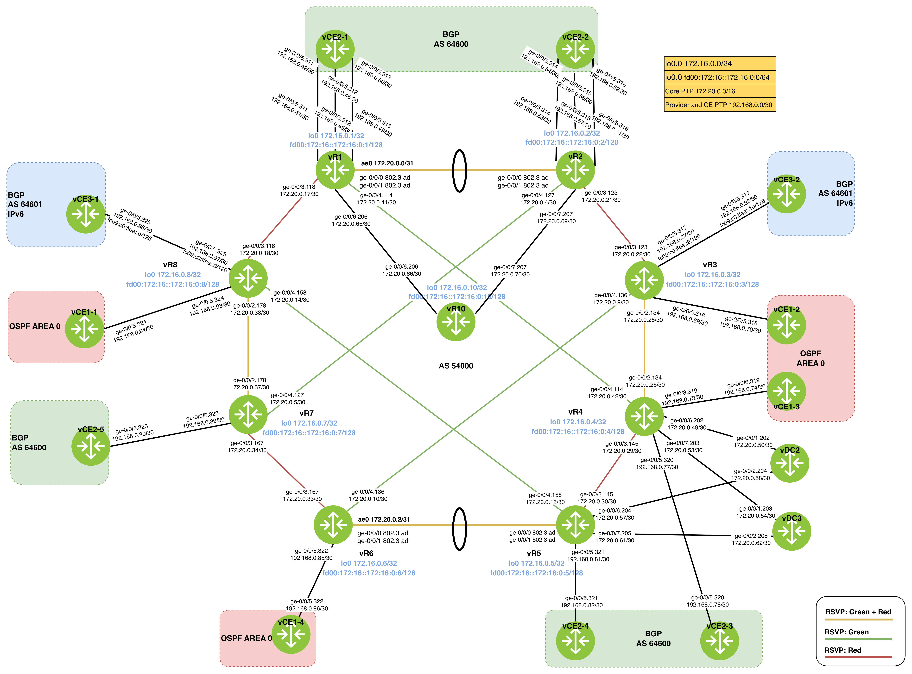

# Create the topolgy 
1. `netlab up`
2. `bash sanitize_junos_config.sh [multi-lab number]`
3. `bash load_junos_config.sh [multi-lab number]`

# Question
1. Validate core and ce interfaces.  `show interface desc`
2. Configure BGP VPNv4 address family on all routers. `set 