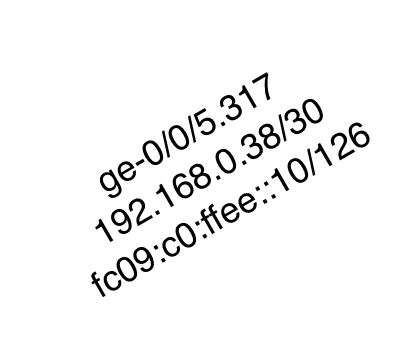

# Create the topolgy 
1. `netlab up --plugin multilab -s defaults.multilab.id=21`
2. `bash sanitize_junos_config.sh [multi-lab number]` - Delete physical interfaces for lacp. 
3. `bash load_junos_config.sh [multi-lab number]` - Bring up lacp, ldp, mpls and add routing policy.

# Lab Question
1. Validate core and ce interfaces.  `show interface desc`
2. Troubleshoot the following:
  - Ensure ISIS adjacency are up, all routers should have 34 adjacencies except for vr1 and vr2 that should have 4. `show isis adjacency | match Up | count `
  - Ensure iBGP sessions are up in vRR.
  - Ensure LDP sessions are up on all routers.
2. Configure BGP VPNv4 address family on all routers.