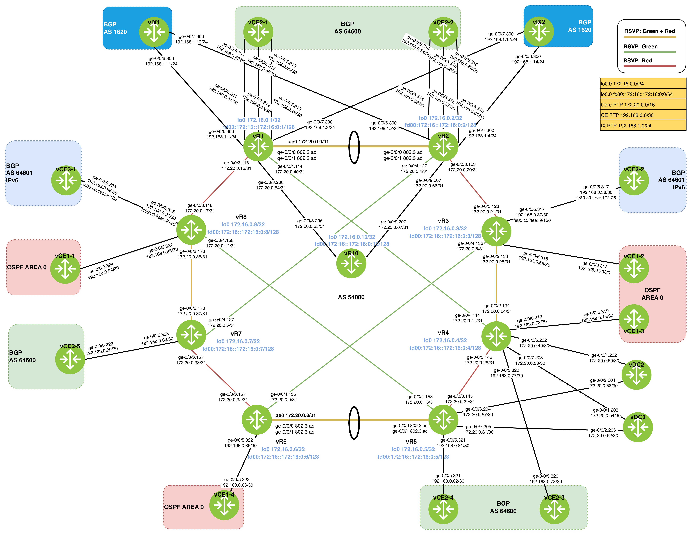

# Create the topolgy 
1. `netlab up --plugin multilab -s defaults.multilab.id=21`
2. `bash load_junos_config.sh [multi-lab number]` - Bring up lacp, ldp, mpls and add routing policy.
2. `bash sanitize_junos_config.sh [multi-lab number]` - Delete physical interfaces for lacp. 

# Lab
1. Validate core and ce interfaces.  `show interface desc`
2. Troubleshoot the following:
  - Ensure ISIS adjacency are up, all routers should have 34 adjacencies except for vr1 and vr2 that should have 4. `show isis adjacency | match Up | count `
  - Ensure 8 iBGP sessions are up in vRR. `show bgp summary | match Est | count`
  - Ensure LDP sessions are up on all routers.
4. Configure BGP VPNv4 address family on all routers.
5. Configure iBGP peering between router reflector, vr1 and vr3 to allow router reflector to advertise a maximum of two paths for each IPv4 unicast prefix. 