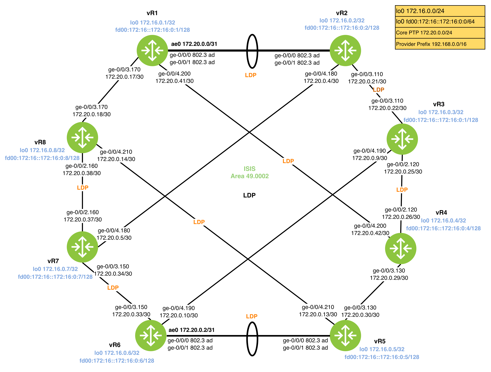

# MPLS LDP
## Task 5.1: LDP Infrastructure & Session Security
- LDP Activation: Enable LDP on all core-facing interfaces and loopbacks (lo0.0) for routers vR1 through vR8.
- Point-to-Multipoint: Ensure LDP is tracking the correct physical/logical interfaces as defined in the diagram.
- Authentication: Configure MD5 authentication for all LDP sessions. Use the same keychain logic as Task 4.1 or an explicit secret juniper123.

## Task 5.2: IGP/LDP Synchronization
- Prevent traffic loss by ensuring that the IGP (IS-IS) does not advertise a link as available until LDP has successfully signaled labels across it.
- Configure IS-IS to track the LDP operational status on all core interfaces.

## Task 5.3: FEC Management & Path Diversity (vR1 & vR2)
- Inject specific IX-facing subnets into LDP.
- Requirement: Ensure each FEC (Forwarding Equivalence Class) advertised by vR1 or vR2 is reachable via a separate LSP. This typically requires manipulating the LDP egress policy or using specific prefix-lists to control label advertisement.

## Task 5.4: Metric Alignment & Label Operations
- IGP Metric Tracking: Configure LDP to ensure that LSPs reflect the same metric as the underlying IS-IS paths. (Note: LDP natively follows the IGP shortest path; this task verifies that no manual metric offsets are overriding the IGP logic).
- Egress Label Popping (PHP): Ensure that LDP labels are "popped" by the egress routers (Penultimate Hop Popping).
- Run show ldp database on the penultimate hop and verify the label for the egress loopback is 3 (Implicit Null).

## 5.5 Verification 

[ ] `show ldp neighbor`: Confirm all sessions are "Up" and "Authenticated".
[ ] `show ldp database`: Verify FECs for all loopbacks (vR1-vR8) are present.
[ ] `show isis interface detail`: Confirm LDP sync: enabled, Status: in sync.
[ ] `show route table mpls.0`: Verify label-switched paths exist for all core loopbacks.
[ ] `traceroute mpls ipv4 <remote-loopback>`: Confirm the path matches the IS-IS best path.
