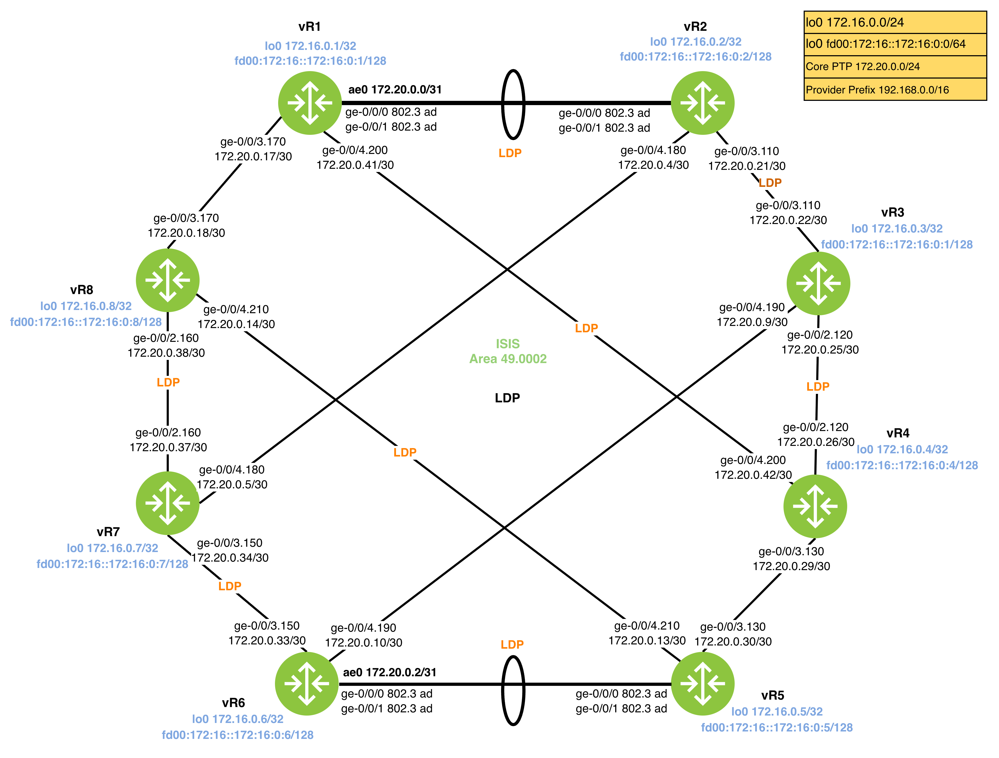

# LDP

There are three requirements to make up LDP -  IGP, LDP and family MPLS.
IGP populates `inet.0`. It provides reachability for LDP neighbors to find each other's loopback addresses and establish TCP session. LDP doesn't care how a route gets into the RIB, you can use static route if you prefer to skip IGP:
```
show configuration routing-options 
static {
    route 172.16.0.5/32 next-hop 172.20.0.3;
}
```
>[!WARNING]
> Using static route for LDP is not recommended in production.

LDP handles "Hello" discovery and label exchange. Defining `set protocols ldp interface` instruct the router to start talking LDP on the interfaces.
Finally, for the data plane to function, mpls needs to be enable globally under `set protocols mpls interface <name> | all` so the router knows how to mange the Label Forwarding Information Base (LFIB) for the interfaces.

For each FEC is reachable by a separate LSP, update the `egress-policy`.

Why? This is because LDP has a implicit egress policy that only advertise loopback address by default . It will reuse the same label and will not automatically generate labels for static routes, direct interface routes, or learned routes.

To announce specific prefixes in additional of the oopback addresses, create an egress policy and apply to LDP:

```
set policy-options policy-statement ldp-export-all from route-filter 192.168.0.0/24 exact
set policy-options policy-statement ldp-export-all from protocol direct
set policy-options policy-statement ldp-export-all then accept
set protocols ldp egress-policy ldp-export-all
```

>[!WARNING]
> When adjusting LDP egress policy, you must add router loopback address or via protocol `direct` in the egress policy or it will take down the control plane.
## Task 0.1: LDP Infrastructure & Session Security
- Enable LDP as shown in the diagram.
- All LDP sessions should be configured with MD5 authentication using secret `juniper123`.

## Task 0.2: IGP/LDP Synchronization 
- Configure IS-IS to track the LDP operational status on all core interfaces.

## Task 0.3: FEC Management
- Inject specific IX-facing subnets into LDP.
- Ensure each FEC (Forwarding Equivalence Class) advertised by vR1 or vR2 is reachable via a separate LSP. This requires manipulating the LDP egress policy or using specific prefix-lists to control label advertisement.

## Task 0.4: Metric Alignment & Label Operations
- Configure LDP to ensure that LSPs reflect the same metric as the underlying IS-IS paths. (Note: LDP natively follows the IGP shortest path; this verifies that no manual metric offsets are overriding the IGP logic).
- Ensure that LDP labels are "popped" by the egress routers via PHP(Penultimate Hop Popping).
- The label for the egress loopback must 3 (Implicit Null).

## Task 0.5: Verification 

- `show ldp neighbor`: LDP sessions are up and authenticated.
- `show ldp database`: Verify FECs for all loopbacks.
- `show isis interface detail`: Confirm LDP sync: enabled, Status: in sync.
- `show route table mpls.0`: Verify label-switched paths exist for all core loopbacks.
- `traceroute mpls ipv4 <remote-loopback>`: Confirm the path matches the IS-IS best path.

### Tips
- Enable ldp md5 authentication - `set protocols ldp sessions x.x.x.x authentication-key`
- LDP must be fully established before IGP paths are used -  `ldp-synchronization`
- Use LDP to use IGP metrics - `track-igp-metric`
- `explicit-null` knob forces LDP to not advertise label 3 for FECs which LSR is the egrsss node.