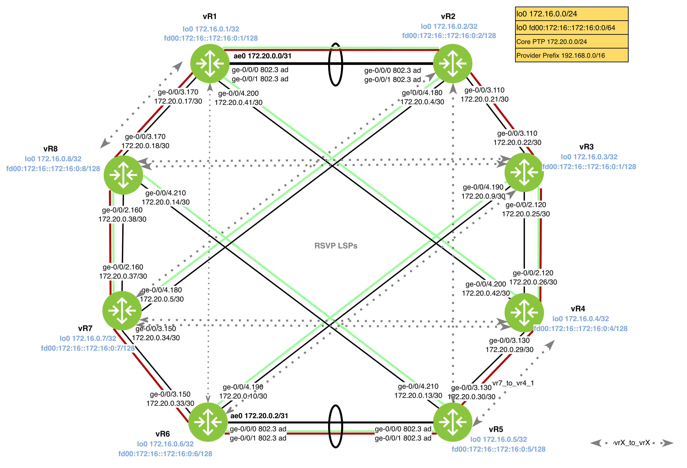

Diagram 1.1: RSVP Topology


| Router | Interface    | Admin Group |
| ------ | ------------ | ----------- |
| vR1    | ge-0/0/4.200 | GREEN       |
| vR1    | ge-0/0/3.170 | RED         |
| vR1    | ae0.0        | GREEN, RED  |
| vR2    | ge-0/0/3.110 | RED         |
| vR2    | ge-0/0/4.180 | GREEN       |
| vR2    | ae0.0        | GREEN, RED  |
| vR3    | ge-0/0/2.120 | GREEN, RED  |
| vR3    | ge-0/0/4.190 | GREEN       |
| vR3    | ge-0/0/3.110 | RED         |
| vR4    | ge-0/0/2.120 | GREEN, RED  |
| vR4    | ge-0/0/4.200 | GREEN       |
| vR4    | ge-0/0/3.130 | RED         |
| vR5    | ge-0/0/3.130 | RED         |
| vR5    | ge-0/0/4.210 | GREEN       |
| vR5    | ae0.0        | GREEN, RED  |
| vR6    | ge-0/0/4.190 | GREEN       |
| vR6    | ge-0/0/3.150 | RED         |
| vR6    | ae0.0        | GREEN, RED  |
| vR7    | ge-0/0/4.180 | GREEN       |
| vR7    | ge-0/0/3.150 | RED         |
| vR7    | ge-0/0/2.160 | GREEN, RED  |
| vR8    | ge-0/0/4.210 | GREEN       |
| vR8    | ge-0/0/3.170 | RED         |
| vR8    | ge-0/0/2.160 | GREEN, RED  |

# RSVP Basics

RSVP is a MPLS signaling protocol to provide bandwidth management, traffic engineering and traffic protection. This lab cover the basis of how RSVP uses path messages (PATH), reservation messages (RESV) and Explicit Route Object (ERO) to propagate the bandwidth through out the LSP "journey". (The reason I call it journey because each hop individual and make up the whole lSP)

This diagram explains the relationship between the PATH, RESV and ERO used to establish a LSP. Notice how each router strips itself from the ERO before forwarding the message? Why?

```
    [ vR1 ]              [ vR2 ]              [ vR3 ]              [ vR4 ]
   (Ingress)             (Transit)            (Transit)            (Egress)
      |                    |                    |                    |
      |  --- PATH Msg ---> |                    |                    |
      |  (ERO: R2,R3,R5)   |  --- PATH Msg ---> |                    |
      |                    |  (ERO: R3,R5)      |  --- PATH Msg ---> |
      |                    |                    |  (ERO: R5)         |
      |                    |                    |                    |

```

First, vR1, the ingress router calculates a path and encapsulates it in the ERO. This message travels downstream to the egress router, vR5.

>[!NOTE]
> Some documentation uses head-end router instead of Ingress router, they represent the same device but in two different perspectives.
> 
> Ingress router is a functional term that found in MPLS [RFC3031](****). It refers to the router where a packet enters the MPLS domain.
> 
> Head-end router is a role term gear toward to the TE tunnel. It is the router that crafts the RSVP `RSVP` message and is respoinsbility for computing the path via CSPF to destination.

Next, vR5 receives the PATH message and triggers a RESV message that travels in the reverse path of the PATH message.

```
      |                    |                    |                    |
      |                    |                    |  <--- RESV Msg --- |
      |                    |                    |  (Label: 10001)    |
      |                    |  <--- RESV Msg --- |                    |
      |                    |  (Label: 10002)    |                    |
      |  <--- RESV Msg --- |                    |                    |
      |  (Label: 10003)    |                    |                    |
      V                    V                    V                    V
```

>[!NOTE]
>RESV Message performs the bandwidth reservation and carries the Label Object.

Finally, data flows from Ingress to Egress using the labels signaled from previous step.

```
      [ vR1 ] ------------> [ vR2 ] ------------> [ vR3 ] ------------> [ vR4 ]
      (Push 10003)        (Swap 10003/10002)   (Swap 10002/10001)   (Pop/Receive)
```

In Summary, this collapsed view shows relationship between the the bidirectional nature of the control plane compared to the unidirectional flow of the data plane:

```

[ vR1 ] data --> [ vR2 ] data --> [ vR3 ] data --> [ vR4 ]
-------------------------------------------------------------
						Path --> 
						<-- Resv 
```
## Task 1.1: Bandwidth Management
- Enable RSVP on all core-facing interfaces for routers vR1 through vR8.
- Configure all RSVP-enabled interfaces to allow exactly 333 Mbps of reservable bandwidth.
- The `ae0` Ethernet bundles must not have a manual bandwidth reservation configured (allow default behavior).

## Task 1.2: Link Coloring
- Implement Resource Affinity by assigning admin groups to links.
- Define the administrative groups globally and apply them to the specified core interfaces.

Diagram 2.2: RSVP Topology


## Task 1.3: RSVP signaled LSPs
- Establish a mesh of RSVP LSPs as shown in diagram 2.2.
- Configure LSPs between specific PEs (vR1 to vR5, etc.).
    - Ensure LSPs utilize the administrative groups defined in Task 6.2 to influence path selection (e.g., `include-any GOLD`).
    - Enable Fast Reroute (FRR) to protect against link and node failures.
- LSP Configuration (assume LSP name is `vrX_to_vrX`)
1) Configure MD5 authentication for all RSVP sessions.
2) Enable BFD continuity checking for all RSVP sessions.
3) Make sure LSPs vr2_to_vr7, vr7_to_vr2,  vr3_to_vr6 and vr6_to_vr3 use only links belonging to the “RED” administrative group.
4) Make sure that LSPs  vr1_to_vr8, vr8_to_vr1, vr8_to_vr1, and T use only links belonging to the “green” administrative group.
5) Configure LSPs vr3_to_vr8_1, vr3_to_vr8_2, vr8_to_vr3_1 and vr8_to_vr3_2 to use two distinct physical paths to the egress node. The paths should take three hops each. You may not use administrative groups in this step.
6) Configure LSPs `vr4_to_vr8_1, vr4_to_vr8_2, vr7_to_vr4_1 and vr7_to_vr4_2` so that they use two distinct physical paths to the egress node. LSPs M and O should use only the “green” links, and LSPs N and P should use only the “red” links.
7) Configure all LSPs except `vr1_to_vr8, vr4_to_vr5, vr8_to_vr1, vr5_to_vr4` to reserve 60 Mbps of bandwidth.
8) Configure LSPs A, B, S, and T to automatically re-signal the LSP once in 48 hours based on the average bandwidth usage. Make sure that the LSPs can use not less than 30 Mbps and not more than 120 Mbps.
9) Configure LSPs `vr1_to_vr8,  vr2_to_vr7, vr3_to_vr8, vr3_to_vr6, vr4_to_vr5` (as well as in reverse direction) to ensure that they have higher priority for bandwidth reservation than the remaining LSPs.
10) Make sure that if LSPs `vr3_to_vr8, vr4_to_vr7`  (as well as in reverse direction)  must be preempted, the ingress router will attempt to re-signal the LSP before tearing it down.
11) Configure automatic optimization for the LSPs `vr3_to_vr8_1, vr3_to_vr8_2, vr4_to_vr7_1, vr4_to_vr7_2`. Set the optimize timer to 8 hours. Make sure that the ingress routers attempt to re-signal the LSP before tearing it down.
12) Make sure that R5 and R6 prefer RSVP LSPs as the next hops for IPv4 BGP routes advertised by IX peers.
13) Configure LDP tunnels between R3 and R8 and between R4 and R7. Make sure that any router in your AS has an LDP-signaled LSP to any other router.
14) Make sure that IPv4 traffic at R8 from P1 to P2 uses LSP I and traffic from P1 to P3 uses LSP K.
15) Configure per-flow load balancing over LSPs `vr4_to_vr7_1 and vr4_to_vr7_2`. Similarly, configure per-flow load balancing over LSPs `vr7_to_vr4_1 and vr7_to_vr4_2`.
16) Make sure that MPLS paths in your network are hidden from external trace route utilities.

## Task 1.4: Verification 

- `show ldp neighbor`: LDP sessions are up and authenticated.
- `show ldp database`: Verify FECs and labels.
- `show isis interface ext`: LDP sync state is`in sync`
- `show route table mpls.0`: Label-switched paths exist for all core loopbacks.
- `traceroute mpls ipv4 <remote-loopback>`: Confirm the path matches the IS-IS best path.

### Tips
- Setting bandwidth -  `set protocols rsvp interface ge-0/0/2.170 bandwidth 333m
- Creating admin groups - ```
```
set protocols mpls admin-groups GREEN 1
set protocols mpls interface ge-0/0/2.170 admin-group GREEN
```