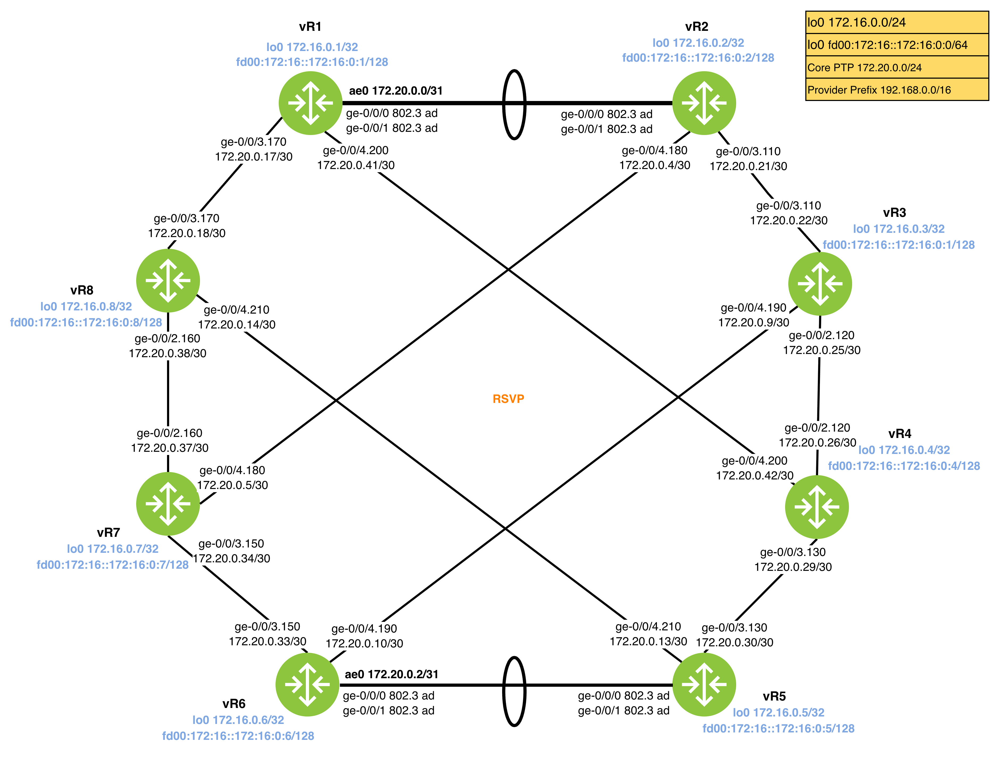

Diagram 1.1: RSVP Topology


# RSVP Basics

RSVP is a signaling protocol to provide bandwidth management, traffic engineering in MPLS. This lab cover the basis of how RSVP uses path messages (PATH), reservation messages (RESV) and Explicit Route Object (ERO) to propagate the bandwidth through out the LSP "journey". I refer it as a 'journey' because  LSP is composed of distinct, individual hops that collectively define the end-to-end path.

This diagram explains the relationship between PATH messages, RESV messages and ERO used to establish a LSP. Notice how each router strips itself from the ERO before forwarding the message?

Think of the ingress router is the entrance, whereas the egress router the exit point where the final node in the RSVP path.

```
    [ vR1 ]              [ vR2 ]              [ vR3 ]              [ vR4 ]
   (Ingress)             (Transit)            (Transit)            (Egress)
      |                    |                    |                    |
      |  --- PATH Msg ---> |                    |                    |
      |  (ERO: R2,R3,R5)   |  --- PATH Msg ---> |                    |
      |                    |  (ERO: R3,R5)      |  --- PATH Msg ---> |
      |                    |                    |  (ERO: R5)         |
      |                    |                    |                    |

```


First, vR1, the ingress router calculates a path and encapsulates it in the ERO. This message travels downstream to the egress router, vR4.

>[!NOTE]
> Some documentation uses head-end router instead of Ingress router, they represent the same device but in two different perspectives.
> 
> Ingress router is a functional term that found in MPLS [RFC3031](****). It refers to the router where a packet enters the MPLS domain.
> 
> Head-end router is a role term gear toward to the TE tunnel. It is the router that crafts the RSVP `RSVP` message and is respoinsbility for computing the path via CSPF to destination.

Second, vR4 receives the PATH message and triggers a RESV message that travels in the reverse path of the PATH message.

```
      |                    |                    |                    |
      |                    |                    |  <--- RESV Msg --- |
      |                    |                    |  (Label: 10001)    |
      |                    |  <--- RESV Msg --- |                    |
      |                    |  (Label: 10002)    |                    |
      |  <--- RESV Msg --- |                    |                    |
      |  (Label: 10003)    |                    |                    |
      V                    V                    V                    V
```

>[!NOTE]
>RESV Message performs the bandwidth reservation and carries the Label Object.

Finally, data flows from Ingress to Egress (again) using the labels signaled from previous step.

```
      [ vR1 ] ------------> [ vR2 ] ------------> [ vR3 ] ------------> [ vR4 ]
      (Push 10003)        (Swap 10003/10002)   (Swap 10002/10001)   (Pop/Receive)
```

In Summary, this collapsed view shows relationship between the bidirectional nature of the control plane compared to the unidirectional flow of the data plane:

```

[ vR1 ] data --> [ vR2 ] data --> [ vR3 ] data --> [ vR4 ]
-------------------------------------------------------------
						Path --> 
						<-- Resv 
```
## Task 1.1: Bandwidth Management

- Enable RSVP on all core-facing interfaces for routers vR1 through vR8.
- Configure all RSVP-enabled interfaces to allow exactly 333 Mbps of reservable bandwidth.
- The `ae0` interfaces must not have a manual bandwidth reservation configured.

### Tips
- Setting reservation -  `set protocols rsvp interface ge-x/y/z bandwidth 111m`