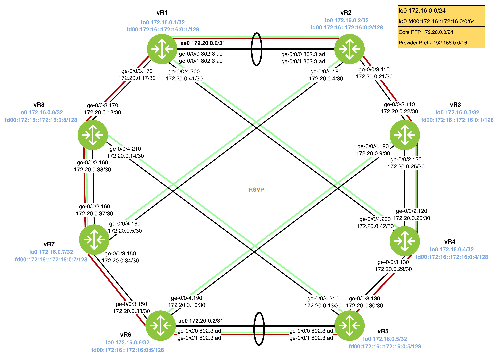

Diagram 1.1: RSVP Topology


| Router | Interface    | Admin Group |
| ------ | ------------ | ----------- |
| vR1    | ge-0/0/4.200 | GREEN       |
| vR1    | ge-0/0/3.170 | RED         |
| vR1    | ae0.0        | GREEN, RED  |
| vR2    | ge-0/0/3.110 | RED         |
| vR2    | ge-0/0/4.180 | GREEN       |
| vR2    | ae0.0        | GREEN, RED  |
| vR3    | ge-0/0/2.120 | GREEN, RED  |
| vR3    | ge-0/0/4.190 | GREEN       |
| vR3    | ge-0/0/3.110 | RED         |
| vR4    | ge-0/0/2.120 | GREEN, RED  |
| vR4    | ge-0/0/4.200 | GREEN       |
| vR4    | ge-0/0/3.130 | RED         |
| vR5    | ge-0/0/3.130 | RED         |
| vR5    | ge-0/0/4.210 | GREEN       |
| vR5    | ae0.0        | GREEN, RED  |
| vR6    | ge-0/0/4.190 | GREEN       |
| vR6    | ge-0/0/3.150 | RED         |
| vR6    | ae0.0        | GREEN, RED  |
| vR7    | ge-0/0/4.180 | GREEN       |
| vR7    | ge-0/0/3.150 | RED         |
| vR7    | ge-0/0/2.160 | GREEN, RED  |
| vR8    | ge-0/0/4.210 | GREEN       |
| vR8    | ge-0/0/3.170 | RED         |
| vR8    | ge-0/0/2.160 | GREEN, RED  |

# RSVP Basics - Admin Groups

## Task 1.2: Link Coloring

- Implement Resource Affinity by assigning admin groups to links.
- Define the administrative groups globally and apply them to the specified core interfaces.

### Tips
- Creating admin groups
```
set protocols mpls admin-groups GREEN 1
set protocols mpls interface ge-0/0/2.170 admin-group GREEN
```