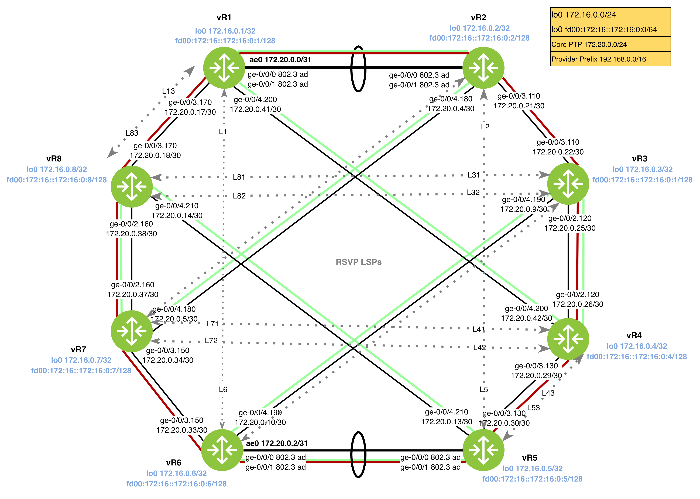

# RSVP Protection

In this task, you will implement  protection mechanisms to ensure traffic continuity across the core.

1. Configure a **secondary backup path** for all RSVP-signaled LSPs in the topology except for `vr3_to_vr8_2`, `vr8_to_vr3_2`, `vr7_to_vr4_2`, `vr4_to_vr2_2`.
2. For `vr1_to_vr6`, `vr6_to_vr1`, `vr2_to_vr5`, `vr5_to_vr2` ensure  protection path is established in standby mode. 
3. Ensure the `secondary` path is configured to share bandwidth with the primary path to optimize resource utilization in the core.
4. Configure LSPs `vr2_to_vr7`, `vr3_to_vr6`, `vr7_to_vr2`, `vr6_to_vr3` to be **non-revertive**. If a switchover to the protection path occurs, the traffic must stay on the backup path even after the primary link is restored.
5. Implement Fast Reroute (FRR) protection for LSPs `vr1_to_vr6`, `vr6_to_vr1`, `vr2_to_vr5`, `vr5_to_vr2`.
	1. The detour LSPs must **not** inherit bandwidth or administrative group settings from the main LSP.
	2. Detour LSPs must not exceed **five hops**.
6. Enable **Link Protection** for LSPs `vr1_to_vr8`,vr2_to_vr7, vr3_to_vr6 and vr4_to_vr5 and the reverse path.

- **L1, L8, L2, L3, L4, L43, L5, and L53**.
    
- _Note: Ensure `link-protection` is also enabled on the participating physical interfaces under `protocols rsvp`._
    

## 7. Node and Link Protection

For LSPs **L81, L82, L83, and L13** (the upper and western diagonal connections), configure both **Link and Node protection** to protect against transit router failures in the core.
## Tips
1. RSVP LSP are configured under `protocol mpls label-switched-path`.
2. Use `show rsvp session extensive` to see the explicit route object.
3. Use `show route table inet.3 protocol rsvp` to see loopback is reachable from MPLS LSPs.
